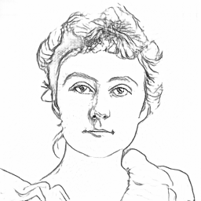
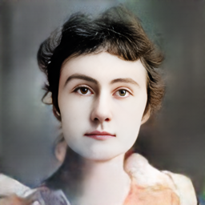
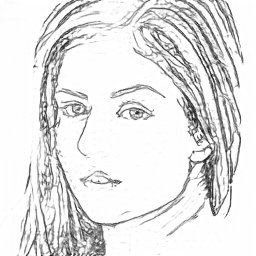
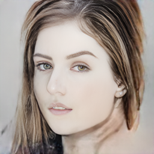
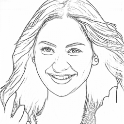
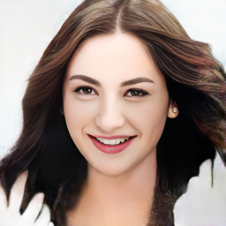
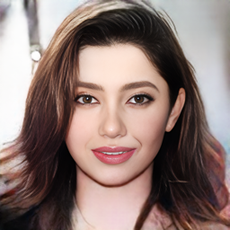
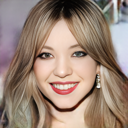

# Sketch-to-Face Forensic Image Synthesis System

> **AI335L Deep Learning Lab — Capstone Project**  
> NASTP Institute of Information Technology · Semester V

A forensic-grade pipeline that synthesizes photorealistic face images from portrait sketches using a **pix2pix GAN** trained on CelebA-HQ paired lineart data, with **CodeFormer** post-processing for high-fidelity enhancement.

**Team:**  
Muhammad Ahmed Moazzam Sharif (S2024CS009) · Bilal Asif (S2024CS005) · Muaz Ahmed (S2024CS016)

---

## Results

| Sketch | Generated |
|--------|-----------|
|  |  |
|  |  |
|  |  |
|  |  |
|  |  |
|  |  |
|  |  |

---

## Demo

[▶ Watch Demo](docs/demo.mp4)

---

## Architecture

```
Portrait Photo / Hand-drawn Sketch
        │
        ▼
LineartDetector (controlnet-aux)   ← sketch extraction from photos
        │
        ▼
   Pix2Pix GAN (UNet-256)          ← trained on CelebA-HQ paired data
        │
        ▼
  CodeFormer (fidelity-weighted)   ← 1024px upscaling + enhancement
        │
        ▼
  Streamlit App (app.py)
```

**Key design decisions:**

- **Pix2Pix over pSp** — the pretrained pSp encoder collapses to a single average face on forensic sketch inputs; pix2pix preserves identity structure at the cost of some color fidelity.
- **LineartDetector** (ControlNet annotators) for sketch generation — produces cleaner, more consistent lines than XDoG or Sobel approaches.
- **CodeFormer** post-processing at configurable fidelity weight — lower fidelity = more restoration; higher = stays closer to the raw pix2pix output.

---

## Repository Structure

```
Sketch2Face/
├── app.py                        # Streamlit app (main entry point)
├── pix2pix_sketch2face.ipynb     # Training notebook (Cells 1–8)
├── requirements.txt
├── assets/
│   └── samples/                  # Sample sketch / output pairs
└── docs/
    ├── demo.mp4                  # Video demo
    ├── report.docx               # Project report
    └── presentation.pptx         # Project presentation
```

**Not included in this repo** (too large for Git):
- Model checkpoints (`pix2pix_checkpoints/`) — see [Releases](#model-weights)
- CelebA-HQ dataset
- Temporary inference outputs

---

## Setup

### Prerequisites

- Windows 10/11 (paths in `app.py` assume Windows; Linux paths work too with minor edits)
- [Anaconda](https://www.anaconda.com/download)
- CUDA-capable GPU (tested on RTX 5880 Ada, sm_89)
- [VS Build Tools 2022](https://visualstudio.microsoft.com/downloads/#build-tools-for-visual-studio-2022) (for CUDA custom ops)

### 1. Create the conda environment

```bash
conda create -n sketch2face python=3.11
conda activate sketch2face
pip install -r requirements.txt
```

### 2. Clone the pix2pix repo

```bash
git clone https://github.com/junyanz/pytorch-CycleGAN-and-pix2pix
cd pytorch-CycleGAN-and-pix2pix
pip install -r requirements.txt
```

### 3. Clone CodeFormer

```bash
git clone https://github.com/sczhou/CodeFormer
cd CodeFormer
pip install -r requirements.txt
python basicsr/setup.py develop
```

### 4. Download model weights  <a name="model-weights"></a>

Download `latest_net_G.pth` from the [Releases](../../releases) page and place it at:

```
pix2pix_checkpoints/
└── sketch2face_pix2pix/
    └── latest_net_G.pth
```

CodeFormer weights are downloaded automatically on first run.

### 5. Configure paths in `app.py`

Edit the config block near the top of `app.py`:

```python
PYTHON_EXE      = r"C:\...\envs\sketch2face\python.exe"
PIX2PIX_REPO    = r"C:\...\pytorch-CycleGAN-and-pix2pix"
CHECKPOINTS     = r"C:\...\pix2pix_checkpoints"
CODEFORMER_REPO = r"C:\...\CodeFormer"
```

### 6. Run the app

```bash
conda activate sketch2face
streamlit run app.py
```

---

## Training Your Own Model

Open `pix2pix_sketch2face.ipynb` and run cells in order:

| Cell | Description |
|------|-------------|
| 1 | Set paths and create output directories |
| 2 | Clone pix2pix repo (run once) |
| 3 | Build paired dataset from CelebA-HQ (sketch ∣ face side-by-side) |
| 4 | Sanity-check dataset samples |
| 5 | Train pix2pix (~2–3 hrs on RTX 5880, 200 epochs) |
| 6 | Evaluate on val set |
| 7 | Visualize results (sketch / generated / GT grid) |
| 8 | Single-image inference test |

**Training config used:**

```
--netG unet_256  --norm batch  --lambda_L1 100
--n_epochs 50    --n_epochs_decay 50   --batch_size 8
--gan_mode vanilla
```

---

## App Features

| Feature | Description |
|---------|-------------|
| **From Photo** tab | Upload a portrait photo → auto face-crop → lineart sketch → generated face |
| **From Sketch** tab | Upload a lineart sketch directly |
| **Sketch confidence heatmap** | Visualizes line density (warm = dense, cool = sparse) |
| **CodeFormer fidelity slider** | Controls restoration strength (0.0–1.0) |
| **Pipeline cards** | Sketch → Pix2Pix → Enhanced step-by-step view |
| **Before/After wipe** | Drag slider to compare sketch and generated face |
| **Diff heatmap** | Shows pixel-level delta between Pix2Pix and CodeFormer |
| **Consistency check** | Re-sketches the generated face and computes SSIM vs original sketch |
| **Download buttons** | Save sketch, pix2pix output, and enhanced result as PNG |

---

## Key Findings

- **pSp is unsuitable for forensic use** — the pretrained model collapses to a single average face regardless of the sketch input; identity is not preserved.
- **Pix2Pix preserves structural identity** better than both pSp and the DeepFacePencil baseline; faces across different sketches remain distinct.
- **Color artifacts** (reddish/cool tints) are the main quality issue in raw pix2pix output; CodeFormer substantially mitigates these.
- **SSIM-based consistency score** provides a quick proxy for identity fidelity without requiring a face-recognition model.

---

## Dependencies

See `requirements.txt`. Core packages:

```
torch >= 2.0
streamlit
opencv-python
controlnet-aux
scikit-image
Pillow
```

---

## Acknowledgements

- [pix2pix (Isola et al., 2017)](https://github.com/junyanz/pytorch-CycleGAN-and-pix2pix)
- [CodeFormer (Zhou et al., 2022)](https://github.com/sczhou/CodeFormer)
- [ControlNet Annotators (lllyasviel)](https://huggingface.co/lllyasviel/Annotators)
- CelebA-HQ dataset

---

## License

This project is for academic purposes only (AI335L coursework). The pix2pix and CodeFormer submodules retain their respective licenses.
